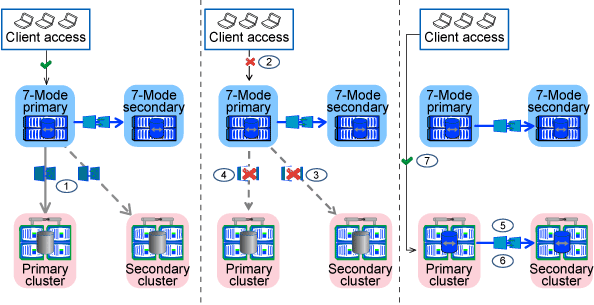

= Modalità di transizione dei volumi in una relazione SnapMirror
:allow-uri-read: 
:icons: font
:imagesdir: ../media/

[role="lead"]
Se si desidera eseguire la transizione di volumi 7-Mode che si trovano in una relazione SnapMirror, è necessario eseguire prima la transizione dei volumi secondari. Viene quindi stabilita una relazione di SnapMirror tra i volumi primari 7-Mode e i volumi secondari ONTAP.

Dopo la transizione dei volumi primari, lo strumento di transizione 7-Mode stabilisce una relazione SnapMirror tra i volumi primari e secondari di ONTAP.

NOTE: Lo strumento di transizione 7-Mode non esegue automaticamente la transizione dei volumi di conformità SnapLock che si trovano in una relazione SnapMirror. Tutti i volumi di conformità SnapLock che si trovano in una relazione SnapMirror devono essere trasferiti come volumi standalone. Dopo la transizione dei volumi di conformità SnapLock primario e secondario a ONTAP, è necessario eseguire manualmente l'operazione di risincronizzazione di SnapMirror tra questi volumi.

È possibile eseguire contemporaneamente il pre-controllo, la copia di riferimento, i trasferimenti incrementali e applicare la configurazione (pre-over) sui progetti primari e secondari; tuttavia, il cutover dello storage per il progetto secondario deve essere eseguito per primo.

== Fase di preparazione

In questa fase, vengono selezionati il sistema 7-Mode, il cluster, i volumi e gli indirizzi IP. 7-Mode Transition Tool esegue le seguenti attività in questa fase:

. Aggiunge informazioni sul volume e sul sistema di storage 7-Mode
. Raccoglie informazioni sui volumi di origine 7-Mode e sulle relazioni SnapMirror:
+
** Per la transizione di un volume secondario, raccogliendo informazioni sul sistema primario 7-Mode
** Per la transizione di un volume primario, raccogliendo informazioni sul sistema secondario 7-Mode

. Esegue il controllo preliminare della transizione
. Aggiunge informazioni su cluster, SVM e aggregati
. Raccoglie gli indirizzi IP che devono essere configurati su SVM:
+
** Selezione degli indirizzi IP presenti nel sistema 7-Mode
** Specifica dei nuovi indirizzi IP da configurare sulla SVM
+

NOTE: La transizione di LIF iSCSI e FC (SAN) non è supportata dal tool. Prima della transizione, è necessario configurare manualmente LE LIF SAN su SVM.

. Crea le pianificazioni delle copie dei dati per i trasferimenti baseline e incrementali.
. Se il progetto contiene volumi SnapLock, raccoglie informazioni sui volumi SnapLock di lettura/scrittura per i quali è richiesta la verifica della catena di custodia e dettagli sul volume ONTAP che memorizza i dati delle impronte digitali generati durante l'operazione di verifica della catena di custodia.
+

NOTE: La verifica della catena di custodia SnapLock è supportata solo per volumi SnapLock in lettura/scrittura 7-Mode. Non è supportato per i volumi di sola lettura. La verifica della catena di custodia SnapLock non è supportata per i volumi SnapLock contenenti file con nomi con caratteri non ASCII.

. Pianifica la transizione della configurazione selezionando le configurazioni 7-Mode che devono essere passate a SVM di destinazione e volumi di destinazione.

Non è necessario modificare gli oggetti (volumi, indirizzi IP, informazioni di sistema e così via) sul controller dopo aver risolto gli errori e gli avvisi segnalati dal controllo preliminare.

== Fase di copia dei dati

In questa fase, i dati dei volumi 7-Mode vengono copiati nei volumi ONTAP. 7-Mode Transition Tool esegue le seguenti attività in questa fase:

. Crea i volumi ONTAP con accesso in sola lettura
. Impostare una relazione peer di transizione tra il sistema 7-Mode e SVM
. Stabilisce una relazione SnapMirror tra i volumi 7-Mode e i volumi ONTAP
. Completa il trasferimento dei dati di riferimento in base agli input pianificati
. Esegue gli aggiornamenti pianificati delle copie dei dati di SnapMirror nei volumi ONTAP

== Fase di applicazione della configurazione (pre-over)

È consigliabile eseguire *Apply Configuration* pochi giorni o settimane prima della finestra di cutover pianificata. Questa pre-verifica consente di avere abbastanza tempo per verificare che tutte le configurazioni siano applicate correttamente e che siano necessarie modifiche.

In questa fase, le configurazioni dei volumi 7-Mode vengono copiate nei volumi ONTAP.

Esistono due modalità per la fase di applicazione della configurazione (pre-utover): Pre-utover in sola lettura e pre-utover in lettura/scrittura.

La modalità di lettura/scrittura pre-over non è supportata quando il progetto contiene quanto segue:

* I volumi SAN e il cluster di destinazione eseguono Data ONTAP 8.3.1 o versioni precedenti
+
In questa situazione, le seguenti configurazioni non vengono applicate nella fase di applicazione della configurazione (pre-over), ma vengono applicate durante la fase di cutover:

+
** Configurazioni SAN
** Configurazioni di pianificazione Snapshot

* Volumi di conformità SnapLock
+
Se il progetto contiene volumi di conformità SnapLock, le configurazioni di pianificazione Snapshot non vengono applicate nella fase di applicazione della configurazione (pre-over). Queste configurazioni vengono invece applicate durante la fase di cutover.

+
xref:concept_considerations_for_transitioning_of_snaplock_compliance_volumes.adoc[Considerazioni per la transizione dei volumi di conformità SnapLock].

Se il cluster di destinazione esegue Data ONTAP 8.3.1 o versioni precedenti e si desidera eseguire l'operazione Apply Configuration (pre-over) in modalità di lettura/scrittura per i volumi NAS, è necessario creare progetti separati per i volumi NAS e SAN. Questa azione è necessaria perché la modalità di lettura/scrittura Apply Configuration (pre-utover) non è supportata se si dispone di volumi SAN nel progetto.

Se il progetto contiene volumi di conformità SnapLock e si desidera eseguire l'operazione di applicazione della configurazione (pre-over) in modalità di lettura/scrittura per i volumi di conformità non SnapLock, è necessario creare progetti separati per i volumi di conformità SnapLock e i volumi di conformità non SnapLock. Questa azione è necessaria perché la modalità di lettura/scrittura Apply Configuration (pre-utover) non è supportata se si dispone di volumi di conformità SnapLock nel progetto.

I seguenti passaggi vengono eseguiti dallo strumento in *modalità di sola lettura pre-over*:

. Esegue un aggiornamento incrementale da volumi 7-Mode a volumi ONTAP
. Interrompe la relazione di SnapMirror tra volumi 7-Mode e volumi ONTAP
+

NOTE: Per i volumi di conformità SnapLock, la relazione di SnapMirror tra il volume 7-Mode e i volumi ONTAP non viene interrotta. Questo perché l'operazione di risincronizzazione di SnapMirror tra i volumi 7-Mode e ONTAP non è supportata per i volumi di conformità SnapLock.

. Raccoglie le configurazioni dai volumi 7-Mode e le applica ai volumi ONTAP e SVM
. Configura le LIF dei dati su SVM:
+
** Gli indirizzi IP 7-Mode esistenti vengono creati sulla SVM in stato di inattività amministrativa.
** I nuovi indirizzi IP vengono creati sulla SVM nello stato di attivazione amministrativa.

. Risincronizza la relazione di SnapMirror tra volumi 7-Mode e volumi ONTAP

I seguenti passaggi vengono eseguiti in *modalità di lettura/scrittura di pre-overover*:

. Esegue un aggiornamento incrementale da volumi 7-Mode a volumi ONTAP
. Interrompe la relazione di SnapMirror tra volumi 7-Mode e volumi ONTAP
. Raccoglie le configurazioni dai volumi 7-Mode e le applica ai volumi ONTAP e SVM
. Configura le LIF dei dati su SVM:
+
** Gli indirizzi IP 7-Mode esistenti vengono creati sulla SVM in stato di inattività amministrativa.
** I nuovi indirizzi IP vengono creati sulla SVM nello stato di attivazione amministrativa.

. Verifica l'accesso ai dati in lettura/scrittura sui volumi ONTAP durante il test di configurazione dell'applicazione (pre-over)
+
Questi volumi ONTAP saranno disponibili per l'accesso in lettura/scrittura dopo l'applicazione della configurazione. Dopo aver applicato la configurazione, i volumi ONTAP sono disponibili per l'accesso in lettura/scrittura, in modo che l'accesso ai dati in lettura/scrittura possa essere verificato su questi volumi durante il test di applicazione della configurazione (pre-over).

. Manuale: Verifica delle configurazioni e dell'accesso ai dati in ONTAP
. Manuale: Terminare il test
+
I volumi ONTAP vengono risincronizzati.

== Fase di cutover dello storage (volumi secondari)

La seguente illustrazione mostra la transizione di un volume secondario:

image::../media/transition_secondary.gif[transizione secondaria]

|===
| Fase | Fasi 

 a| 
Cutover dello storage (volumi secondari)
 a| 
. Transizione dei volumi secondari
. Interruzione ed eliminazione della relazione di SnapMirror tra i volumi secondari
. Stabilire una relazione di DR tra i volumi primari 7-Mode e secondari ONTAP

|===
7-Mode Transition Tool esegue le seguenti attività in questa fase:

. Facoltativo: Esegue un aggiornamento SnapMirror on-demand sui volumi secondari ONTAP
. Manuale: Disconnessione dell'accesso client, se necessario
. Esegue un aggiornamento finale di SnapMirror dal volume secondario 7-Mode al volume secondario ONTAP
. Interrompe ed elimina la relazione di SnapMirror tra il volume secondario 7-Mode e il volume secondario ONTAP e rende i volumi di destinazione in lettura/scrittura
. Applica la configurazione delle pianificazioni Snapshot, se il cluster di destinazione esegue Data ONTAP 8.3.0 o 8.3.1 e il progetto contiene volumi SAN
. Applica le configurazioni SAN, se il cluster di destinazione esegue Data ONTAP 8.3.1 o versioni precedenti
+

NOTE: Tutti gli igroups richiesti vengono creati durante questa operazione. Per i volumi secondari, il mapping delle LUN a igroups non è supportato durante l'operazione di cutover. È necessario mappare manualmente le LUN secondarie dopo aver completato l'operazione di cutover dello storage dei volumi primari. Tuttavia, per i volumi standalone inclusi nel progetto secondario, le LUN vengono mappate agli igroups durante questa operazione.

. Applica le configurazioni di quota, se presenti
. Stabilisce una relazione SnapMirror tra i volumi sul sistema primario 7-Mode e i volumi secondari ONTAP
+
La pianificazione di SnapMirror utilizzata per aggiornare le relazioni di SnapMirror tra i volumi primari 7-Mode e i volumi secondari 7-Mode viene applicata alle relazioni di SnapMirror tra i volumi primari 7-Mode e i volumi secondari ONTAP.

. Rimuove gli indirizzi IP 7-Mode esistenti selezionati per la transizione dal sistema 7-Mode e porta i dati LIF su SVM allo stato di attivazione amministrativa
+

NOTE: LE LIF SAN non vengono migrate dal 7-Mode Transition Tool.

. Facoltativo: Portare i volumi 7-Mode offline

== Fase di cutover dello storage (volumi primari)

La seguente illustrazione mostra la transizione di un volume primario:

|===
| Fase | Fasi 

 a| 
Cutover dello storage (volumi primari)
 a| 
. Transizione dei volumi primari
. Disconnessione dei client dal sistema 7-Mode (cutover dello storage)
. Interruzione ed eliminazione della relazione DR tra i volumi primari 7-Mode e secondari ONTAP
. Interruzione ed eliminazione della relazione di SnapMirror tra i volumi primari
. Impostazione di una relazione peer SVM tra i volumi primari e secondari di ONTAP
. Risincronizzazione della relazione di SnapMirror tra volumi ONTAP
. Abilitazione dell'accesso client ai volumi ONTAP

|===
7-Mode Transition Tool esegue le seguenti attività in questa fase:

. Facoltativo: Esegue un aggiornamento SnapMirror on-demand sui volumi secondari ONTAP
. Manuale: Disconnessione dell'accesso client dal sistema 7-Mode
. Esegue un aggiornamento incrementale finale dal volume primario 7-Mode e dal volume primario ONTAP
. Interrompe ed elimina la relazione di SnapMirror tra il volume primario 7-Mode e il volume primario ONTAP e rende i volumi di destinazione in lettura/scrittura
. Applica la configurazione delle pianificazioni Snapshot se il cluster di destinazione esegue Data ONTAP 8.3.0 o 8.3.1 e il progetto contiene volumi SAN
. Applica le configurazioni SAN, se il cluster di destinazione esegue Data ONTAP 8.3.1 o versioni precedenti
. Applica le configurazioni di quota, se presenti
. Interrompe ed elimina la relazione di SnapMirror tra il volume primario 7-Mode e il volume secondario ONTAP
. Impostazione delle relazioni peer del cluster e peer SVM tra i cluster primario e secondario
. Impostazione di una relazione SnapMirror tra il volume ONTAP primario e quello secondario
. Risincronizza la relazione di SnapMirror tra i volumi ONTAP
. Rimuove gli indirizzi IP 7-Mode esistenti selezionati per la transizione dal sistema 7-Mode e porta i LIF dei dati sulla SVM primaria allo stato di attivazione amministrativa
+

NOTE: LE LIF SAN non vengono migrate dal 7-Mode Transition Tool.

. Facoltativo: Portare i volumi 7-Mode offline

== Processo di verifica della catena di custodia per i volumi SnapLock

Eseguire l'operazione di verifica della catena di custodia.

. Enumera tutti i file WORM dei volumi 7-Mode
. Calcola l'impronta digitale per ogni file WORM sui volumi 7-Mode (enumerati nel passaggio precedente) e calcola l'impronta digitale per il file WORM corrispondente sui volumi ONTAP in transizione.
. Genera un report con dettagli sul numero di file con impronte digitali corrispondenti e non corrispondenti e sul motivo della mancata corrispondenza

[NOTE]
====
* L'operazione di verifica della catena di custodia è supportata solo per i volumi SnapLock in lettura/scrittura che hanno nomi di file con solo caratteri ASCII.
* Questa operazione può richiedere molto tempo in base al numero di file presenti nei volumi SnapLock 7-Mode.

====

== Fasi successive alla transizione

Una volta completata la fase di cutover, è necessario eseguire le seguenti attività post-transizione:

. Eseguire le procedure manuali per la transizione delle funzionalità disponibili nel sistema 7-Mode, ma che non sono state automaticamente passate alla SVM dallo strumento.
. Se il cluster di destinazione esegue Data ONTAP 8.3.1 o versioni precedenti, è necessario mappare manualmente le LUN secondarie.
. Per le transizioni SAN, riconfigurare manualmente gli host.
+
http://docs.netapp.com/ontap-9/topic/com.netapp.doc.dot-7mtt-sanspl/home.html["Transizione e correzione degli host SAN"]

. Assicurarsi che la SVM sia pronta a fornire i dati ai client verificando quanto segue:
+
** I volumi sulla SVM sono online e di lettura/scrittura.
** Gli indirizzi IP in transizione sono up e raggiungibili sulla SVM.

. Reindirizzare l'accesso del client ai volumi ONTAP.

*Informazioni correlate*

xref:task_transitioning_volumes_using_7mtt.adoc[Migrazione di dati e configurazione da volumi 7-Mode]
