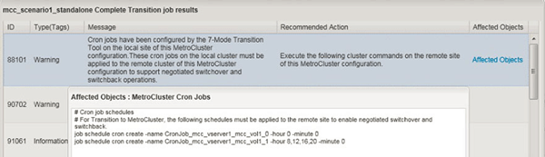

= Configurazione delle pianificazioni dei processi cron sul sito remoto dopo la transizione di una configurazione MetroCluster
:allow-uri-read: 
:icons: font
:imagesdir: ../media/

[role="lead"]
Le pianificazioni dei job cron create durante la transizione non vengono replicate nel sito remoto e, di conseguenza, lo switchover negoziato non riesce dopo la transizione. È necessario creare manualmente le pianificazioni dei processi cron sul sito remoto dopo la transizione.

Il cutover dello storage per il sito attivo 7-Mode deve essere stato completato correttamente.

.Fasi
. Registrare i messaggi di processo cron generati al cutover dello storage per identificare le pianificazioni dei processi che devono essere replicate nel sito remoto.
+

. Dalla CLI del cluster del sito remoto, eseguire `job schedule cron create` comandi registrati in <<STEP_F72D5FA759564336A365328A3414D57A,Fase 1>>.

