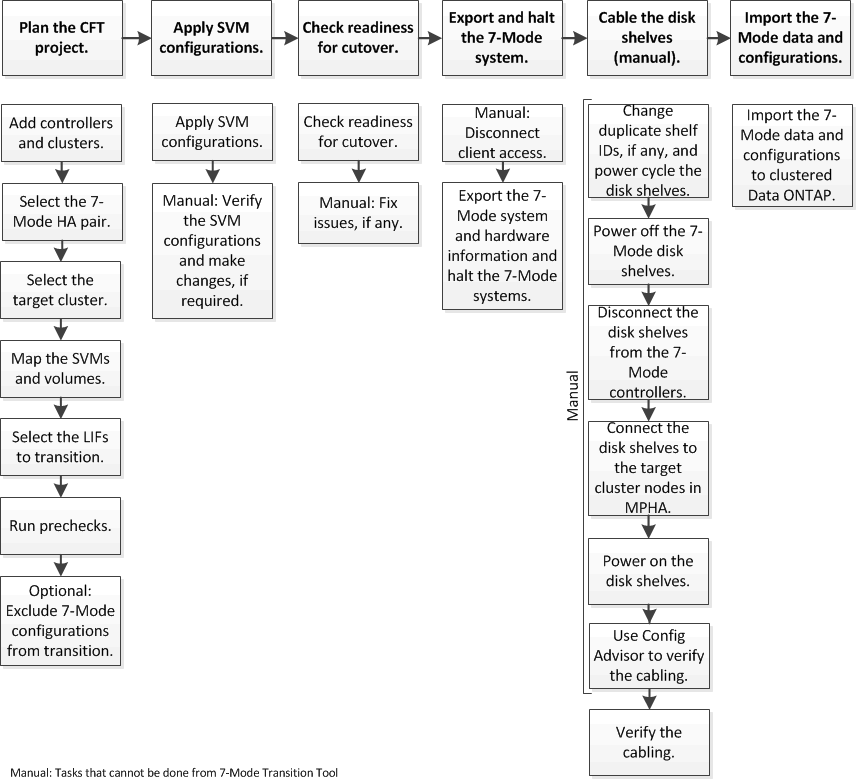

= Transizione di aggregati 7-Mode con transizione senza copia
:allow-uri-read: 
:icons: font
:imagesdir: ../media/

[role="lead"]
Il workflow di transizione senza copia prevede la pianificazione di un progetto, l'applicazione di configurazioni 7-Mode alle SVM, l'esportazione delle informazioni di sistema 7-Mode e l'arresto del sistema 7-Mode, il cablaggio manuale degli shelf di dischi ai nodi del cluster e l'importazione dei dati e delle configurazioni 7-Mode.

È necessario aver preparato il sistema 7-Mode e il cluster per la transizione senza copia.

Il tempo di cutover dello storage può essere di 4-8 ore o meno. Il tempo di cutover include il tempo impiegato dallo strumento per eseguire due operazioni automatizzate - esportazione, interruzione e importazione - e il tempo impiegato per collegare manualmente gli shelf di dischi ai nuovi controller.

Le operazioni di esportazione e importazione richiedono circa 2 ore o meno. Il cablaggio può richiedere 2-6 ore o meno.
